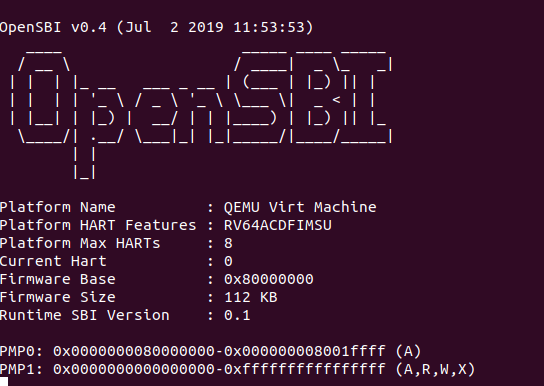

# LAB0.5
## 实验启动
首先进入实验代码的lab0，在目录下打开终端，运行如下代码，使qemu模拟的riscv架构CPU上电，但暂时不执行指令

```bash
qemu-system-riscv64        
    -machine virt
    -nographic         
    -bios default         
    -device loader,file=/home/lchos/Desktop/riscv64-ucore-labcodes/lab0/bin/ucore.img,addr=0x80200000        
    -s -S
```
运行指令后，由于CPU暂不执行指令，所以暂时没有输出

此时再在lab0目录下打开一个终端，运行`make gdb`，接入调试工具

终端会输出如下提示，此时gdb与qemu连接成功，可以开始调试
```bash
riscv64-unknown-elf-gdb \
    -ex 'file bin/kernel' \
    -ex 'set arch riscv:rv64' \
    -ex 'target remote localhost:1234'
GNU gdb (SiFive GDB-Metal 10.1.0-2020.12.7) 10.1
```
## 实验进行
首先输入`x/10i $pc`，输出当前要执行的10条指令：
```bash
=> 0x1000:	auipc	t0,0x0
   0x1004:	addi	a1,t0,32
   0x1008:	csrr	a0,mhartid
   0x100c:	ld	t0,24(t0)
   0x1010:	jr	t0
   0x1014:	unimp
   0x1016:	unimp
   0x1018:	unimp
   0x101a:	0x8000
   0x101c:	unimp
```
发现指令`auipc	t0,0x0`首先对t0进行赋pc值,然后经过对a1与a0的操作后，指令通过`ld	t0,24(t0)`对t0的值进行进一步更改，然后通过`jr	t0`进行跳转

此时可以通过`info r t0`查看t0的值，是0x80000000

然后通过不断输入`si`指令，单步运行程序至0x80000000处，再通过`x/10i 0x80000000`查看即将要被执行的10条指令：
```bash
   0x80000000:	csrr	a6,mhartid
   0x80000004:	bgtz	a6,0x80000108
   0x80000008:	auipc	t0,0x0
   0x8000000c:	addi	t0,t0,1032
   0x80000010:	auipc	t1,0x0
   0x80000014:	addi	t1,t1,-16
   0x80000018:	sd	    t1,0(t0)
   0x8000001c:	auipc	t0,0x0
   0x80000020:	addi	t0,t0,1020
   0x80000024:	ld	    t0,0(t0)
```
发现大部分是一些对寄存器值的更改与加载操作，猜测应是在为执行位于0x80200000的第一条指令做准备。

此时我们在猜测是否会有一条像`jr	t0`那样的跳转操作，将程序带到`0x80200000`处，于是便开始了寻找

通过`x/100i 0x80000000`一次性显示更多程序以进行在大致判断跳转，在此基础上用`si`，`break *0x...`与`continue`不断进行调试观察程序执行位置，如此不断进行，我们寻找至`0x80001000`位置仍未发现跳转点，但发现指令大多为寄存器值的修改与装、加载，猜测有大量的准备工作要进行，于是便放弃寻找

然后直接将断点打至`0x80200000`处，用`continue`执行过去一探究竟

在执行`break *0x80200000`时，发现终端弹出提示
```bash
(gdb) break *0x80200000
Breakpoint 1 at 0x80200000: file kern/init/entry.S, line 7.
```
验证了`0x80200000`是操作系统程序入口点的猜想

执行至此后，发现qemu界面产生输出，即ucore开始运行


使用`x/10i $pc`查看位于此处的十条指令：
```bash
=> 0x80200000 <kern_entry>:	auipc	sp,0x3
   0x80200004 <kern_entry+4>:	mv	sp,sp
   0x80200008 <kern_entry+8>:	j   0x8020000a <kern_init>
   0x8020000a <kern_init>:	auipc	a0,0x3
   0x8020000e <kern_init+4>:	addi	a0,a0,-2
   0x80200012 <kern_init+8>:	auipc	a2,0x3
   0x80200016 <kern_init+12>:	addi	a2,a2,-10
   0x8020001a <kern_init+16>:	addi	sp,sp,-16
   0x8020001c <kern_init+18>:	li	a1,0
   0x8020001e <kern_init+20>:	sub	a2,a2,a0
```
通过`<kern_entry>`与`<kern_init>`等函数可以看出，此时是操作系统的初始化阶段，ucore系统在此刻开始运行

此时可以通过`info register`查看寄存器信息，看看准备工作的结果
```bash
(gdb) info register
ra             0x80000a02	0x80000a02
sp             0x8001bd80	0x8001bd80
gp             0x0	0x0
tp             0x8001be00	0x8001be00
t0             0x80200000	2149580800
t1             0x1	1
t2             0x1	1
fp             0x8001bd90	0x8001bd90
s1             0x8001be00	2147597824
a0             0x0	0
a1             0x82200000	2183135232
a2             0x80200000	2149580800
a3             0x1	1
a4             0x800	2048
a5             0x1	1
a6             0x82200000	2183135232
a7             0x80200000	2149580800
s2             0x800095c0	2147521984
s3             0x0	0
s4             0x0	0
s5             0x0	0
s6             0x0	0
s7             0x8	8
```

## 实验总结
总而言之，qemu要首先进行复位，并将程序跳转至`0x80000000`处,运行操作系统的bootloader，进行大量准备工作，然后运行至`0x80200000`处，加载操作系统的内核，完成操作系统的运行